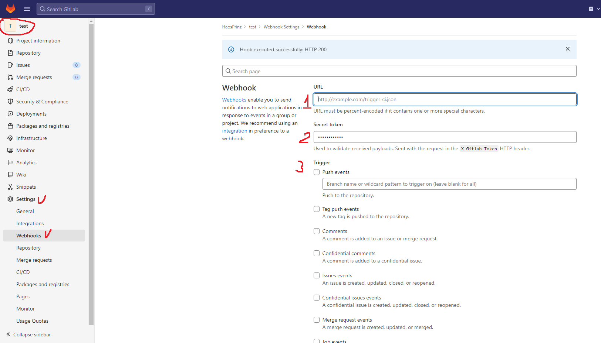

# Gitlab-bot-notification
Сервис отправки уведомлений в телеграмм из гитлаба реализованные на Flask

--------------
# Инструкция

### КАК НАСТРОИТЬ ПРОЕКТ

1) Скачиваем репозиторий
2) Создаем .env файл копирую .env.dist
3) заполняем через запятую CHANNELS - чаты куда необходимо отправлять информацию
4) заполняем BOT_TOKEN полученный от бот [Father](https://t.me/botfather) 
Чтобы приходили уведомления:  
а) в личный чат - необходимо зарание написать боту start  
б) в группу - необходимо бота сделать администратором группы, чтобы он мог отправлять сообщения
5) Сервис запускается на 10111 порту данную информацию можно изменить в файле main.py

### КАК НАСТРОИТЬ Gitlab

1) Заходим в проект
2) Переходим в настройки проекта
3) Переходим на вкладку Webhooks как показано на скриншоте выше
4) Заполняем URL, где у вас располагается сервис
5) Придумываем секретный токен
6) Выбираем тригеры после срабатывания, которых Gitlab отправит вам уведомление в сервис
7) Нажимаем сохранить